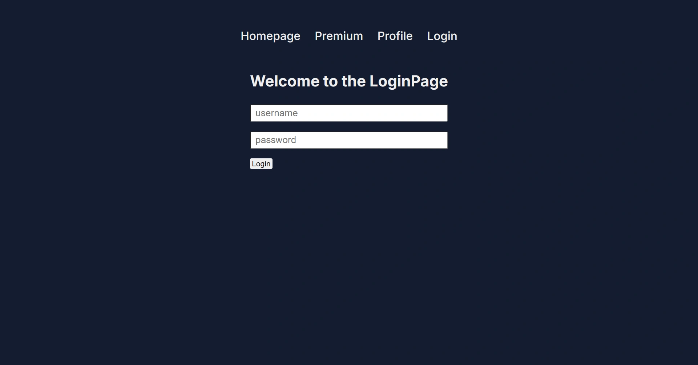

<div align="center">
    <a href="https://iphone15-fv.netlify.app" target="_blank">
      
    </a>
  <h3 align="center">Auth Cookie Session - Next.js 14</h3>
</div>

##  <br /> 📋 <a name="table">Table of Contents</a>

- ✨ [Introduction](#introduction)
- ⚙️ [Tech Stack](#tech-stack)
- 📝 [Features](#features)
- 🚀 [Quick Start](#quick-start)

##  <br /> <a name="introduction">✨ Introduction</a>

**[EN]** This project demonstrates cookie-based authentication and authorization in a Next.js 14 app using the app router. It utilizes Iron-Session for managing cookie sessions and integrates with TypeScript for type safety. This setup provides a straightforward approach to implementing authentication in Next.js, showcasing best practices for secure and efficient session management.

**[FR]** Cette solution illustre l'authentification et l'autorisation basées sur des cookies dans une application Next.js 14 en utilisant le routeur de l'application. Elle utilise Iron-Session pour la gestion des sessions par cookies et s'intègre avec TypeScript pour une sécurité de type. Cette configuration offre une approche simple pour mettre en œuvre l'authentification dans Next.js, en mettant en avant les meilleures pratiques pour une gestion sécurisée et efficace des sessions.

##  <br /> <a name="tech-stack">⚙️ Tech Stack</a>

- **React** is a popular JavaScript library for building user interfaces, particularly single-page applications where data changes over time. React's component-based architecture allows developers to create reusable UI components, making development more efficient and the codebase easier to maintain. 

- **Next.js** is a React framework known for its server-side rendering (SSR) and static site generation (SSG) capabilities, enhancing performance and SEO for web applications. It offers features like automatic code splitting, API routes for server-side logic, and a plugin system for extensibility.

- **TypeScript** is a statically typed superset of JavaScript that allows for early detection of errors and more robust, maintainable code. TypeScript's type system helps developers catch mistakes early during the development process, ensuring a more stable and reliable application.

- **Iron-Session** is a TypeScript library for managing session data in Next.js applications using cookies. It provides a secure way to handle session storage by encrypting and signing cookies to prevent tampering and ensure data integrity. Iron-Session simplifies session management with easy-to-use APIs for creating, retrieving, and updating session data. It integrates seamlessly with Next.js and TypeScript, offering type-safe session handling without relying on additional libraries.

- **Cookie Session** is a method of managing user sessions in web applications using cookies. It involves storing session data directly in the browser’s cookies, which are sent with each HTTP request. This approach enables stateful authentication and tracking without server-side storage. Cookie sessions are simple to implement and widely supported but require careful management of cookie security, including encryption and proper expiration settings, to prevent unauthorized access and data breaches.


## <br /> <a name="quick-start">🚀 Quick Start</a>

Follow these steps to set up the project locally on your machine.

<br/>**Prerequisites**

Make sure you have the following installed on your machine:

- [Git](https://git-scm.com/)
- [Node.js](https://nodejs.org/en)
- [npm](https://www.npmjs.com/) (Node Package Manager)

<br/>**Cloning the Repository**

```bash
git clone {git remote URL}
```

<br/>**Installation**

Let's install the project dependencies, from your terminal, run:

```bash
npm install
# or
yarn install
```

<br/>**Set Up Environment Variables**

Create a new file named `.env` in the root of your project and add the following content:

```env
SECRET_KEY=
```


<br/>**Running the Project**

Installation will take a minute or two, but once that's done, you should be able to run the following command:

```bash
npm run dev
# or
yarn dev
```

Open [`http://localhost:3000`](http://localhost:3000) in your browser to view the project.